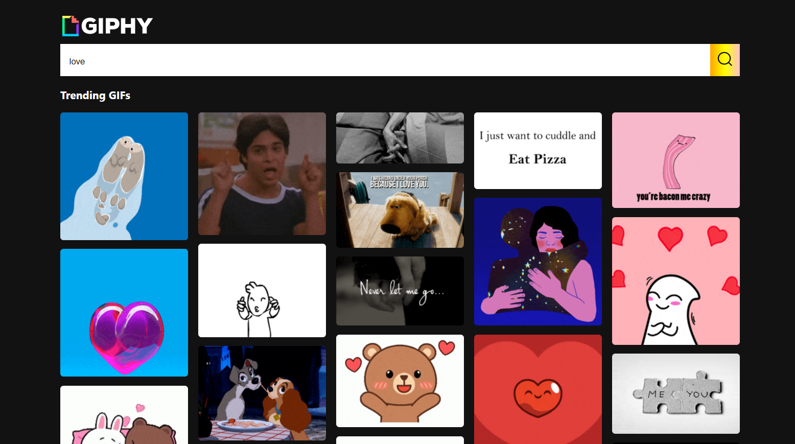
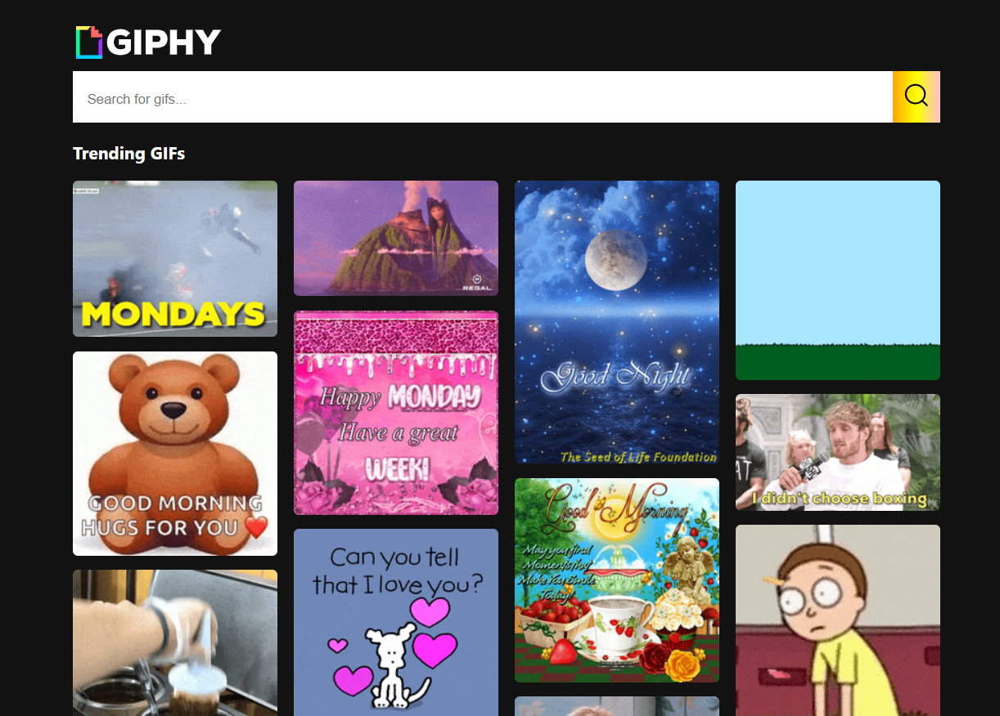
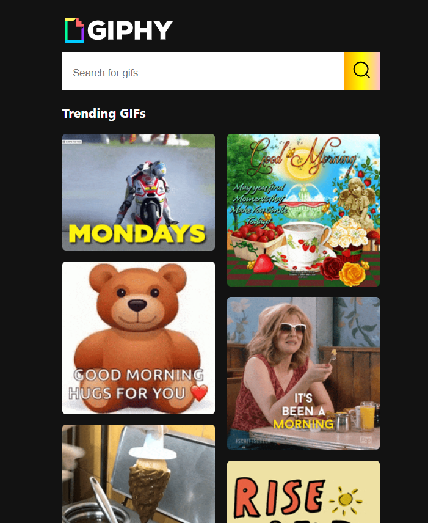

# Getting Started with Create React App

This project was bootstrapped with [Create React App](https://github.com/facebook/create-react-app).

## Available Scripts

To clone the project run:

### `git clone <url>`

To install the packages:

### `yarn install`

In the project directory, you can run:

### `yarn start`

Here are the view of the project

